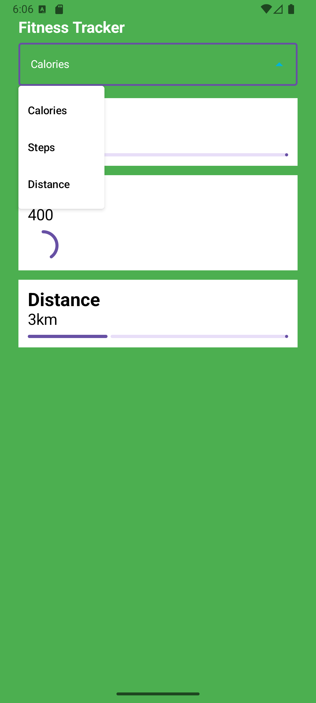

# Fitness Tracker App

A simple and elegant Fitness Tracker application built with Jetpack Compose. This app allows users to track their daily activities like Calories, Steps, and Distance.

## Features

- **Activity Tracking**: Monitor Calories, Steps, and Distance.
- **Dropdown Menu**: Easily switch between different fitness metrics.
- **Progress Visualization**: Includes Linear and Circular progress indicators for each activity.
- **Clean UI**: White item cards against a vibrant green background for high visibility.
- **Large Text**: Optimized for readability with bold titles and clear values.

## Screenshots

| Main Screen | Dropdown Expanded |
|-------------|-------------------|
|  |  |

## Tech Stack

- **Language**: Kotlin
- **UI Framework**: Jetpack Compose
- **Design System**: Material Design 3

## Project Structure

- `MainActivity.kt`: Entry point of the application.
- `Items.kt`: Contains the main `FitnessScreen` and the activity list UI.
- `Dropdown.kt`: Contains the shared `FitnessDropdown` component and global state variables.

## How to Run

1. Clone this repository.
2. Open the project in Android Studio.
3. Build and run on an emulator or a physical device.
